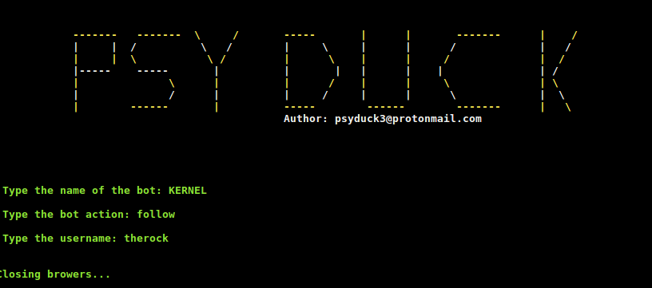

# Usage
    * git clone https://github.com/I-am-psy-duck/psy-duck-bots.git
    * cd psy-duck-bots

# Installing dependencies
    * pip install -r requirements.txt 

# Version
    * 1.1
    
    * INSTAGRAM BOT

        - The bot for instagram is available, it can:
            * Follow a user
            * Get Followers
            * Get Following
            * Like and comment posts
            * Download posts

        - Can read JSON files and then do all the instructions

# Requirements
    * Google Chrome
    * Selenium
    * Chrome Driver 
    * Sqlite3 - If HTML elements change

# Generating or showing available bots
    * Generating
        - python bots.py --create   

    * Showing 
        - python bots.py --show  

    * Creating JSON files
        - python bots.py --generate

## Contributing
Pull requests are welcome. For major changes, please open an issue first to discuss what you would like to change.

# Authors
psyduck3@protonmail.com
 
